# Deepthink Mode - Complete Architecture Documentation

## Executive Overview

Deepthink is a sophisticated multi-agent reasoning system designed for solving complex problems through parallel exploration of diverse interpretive frameworks. Unlike conversational AI that optimizes for quick responses, Deepthink optimizes for **thinking quality** by eliminating time pressure, exploring the complete solution space through independent agent collaboration, and implementing rigorous critique-correction cycles.

The system's fundamental innovation lies in its ability to generate multiple independent strategic interpretations of a problem, execute each framework completely and independently, synthesize diagnostic intelligence from critiques, and progressively refine solutions through iterative corrections with optional sophisticated features like PostQualityFilter and StructuredSolutionPool.

---

## Core Architectural Principles

### 1. Parallel Framework Exploration
The system generates multiple distinct strategic interpretations of a problem and executes each independently in parallel. This ensures comprehensive exploration of the solution space rather than premature convergence on a single approach.

### 2. Agent Independence & Isolation
Each agent operates in isolation with carefully controlled shared context. This enforces genuine diversity in reasoning approaches and prevents convergent thinking that would undermine the system's exploratory power.

### 3. Shared Context Architecture
The system maintains **three types** of shared context:

- **Knowledge Packet**: Validated insights from hypothesis testing agents, shared with all solution execution agents
- **Dissected Observations Synthesis**: Comprehensive diagnostic intelligence from critique synthesis, shared with corrector agents (in non-iterative refinement mode)
- **StructuredSolutionPool Repository**: Real-time synchronized solution exploration repository containing solutions, critiques, corrections, and pool outputs from ALL strategies across all iterations, shared with corrector agents and solution pool agents (when enabled in iterative corrections mode with StructuredSolutionPool)

### 4. Domain Adaptive Framework
The system is **universally adaptive** across all domains - mathematical problems, creative writing, legal analysis, software architecture, research methodology, prompt optimization, etc. Every agent adapts its cognitive approach, standards for rigor, and criteria for success based on the actual domain and nature of the challenge.

### 5. Three-Phase Pipeline Structure
- **Track A: Strategic Solver** - Generates and executes interpretive frameworks
- **Track B: Hypothesis Explorer** (optional) - Generates validated contextual knowledge in parallel
- **Phase C: Final Judging** - Selects the best solution from all refined attempts

---

## Configuration Controls & System Impact

[Content continues in next part...]

### Strategic Generation Controls

#### **Number of Initial Strategies** (Adaptive, default: 3)
Controls how many high-level strategic interpretations are generated for the problem.

**System Impact:**
- Each strategy represents a fundamentally different conceptual lens
- Each strategy spawns its own sub-strategy tree (if sub-strategies enabled)
- Each strategy receives independent red team evaluation (if enabled)
- Each strategy is evaluated by PostQualityFilter (if enabled in iterative mode)
- More strategies = broader search space but longer execution time

#### **Number of Sub-Strategies per Main Strategy** (Adaptive, default: 3)
Controls how many nuanced interpretations are generated within each main strategy.

**System Impact:**
- **When enabled**: Each main strategy branches into N sub-strategies
- **When disabled** (Skip Sub-Strategies toggle): Each main strategy creates one "direct" sub-strategy
- Each sub-strategy is independently executed, critiqued, and refined
- Sub-strategies represent distinct interpretive lenses **within** their parent strategy

#### **Skip Sub-Strategies Toggle** (default: off)
Completely disables the sub-strategy decomposition phase.

**System Impact:**
- When **enabled**: Main strategies execute directly without decomposition
- Creates one "direct" sub-strategy per main strategy internally (for system consistency)
- **Required** for PostQualityFilter mode
- **Required** for StructuredSolutionPool mode
- Simplifies pipeline for problems where fine-grained decomposition isn't beneficial

### Hypothesis Exploration Controls

#### **Number of Hypotheses** (Adaptive, default: 4, can be set to 0)
Controls how many hypotheses are generated and tested in parallel with strategic generation.

**System Impact:**
- Setting to **0** completely disables Track B (Hypothesis Explorer)
- Each hypothesis is tested independently by a dedicated testing agent with **no shared context**
- Results are synthesized into the **Knowledge Packet**
- Knowledge Packet is shared with **all solution execution agents**
- When disabled: Knowledge Packet contains placeholder indicating hypothesis exploration is off

**Hypothesis Generation & Testing Process:**
1. **Hypothesis Generation Agent** receives problem, generates N hypotheses (high-level insights, NOT solutions)
2. Each hypothesis assigned to independent **Hypothesis Testing Agent**
3. Testing agents operate in complete isolation: receive only (problem + single hypothesis)
4. Testing protocol: Dual-pronged investigation (simultaneously validate AND refute)
5. Results collected into Full Information Packet structure
6. Information Packet shared with all solution execution agents

**Critical Hypothesis Agent Constraints:**
- Generation: NEVER solve problem, NEVER embed assumed answers
- Testing: Complete isolation, exhaustive edge cases, first-principles reasoning, intellectual honesty
- No memory-based pattern matching, must actively distrust own memory

### Refinement Mode Controls

#### **Refinement Enabled** (default: on)
Controls whether solutions undergo critique and improvement.

**When disabled:**
- Solutions proceed directly to final judging without critique or refinement
- `refinedSolution = solutionAttempt` immediately
- No critique agents spawned, no corrector agents spawned

**When enabled:**
- Solutions undergo critique and refinement process
- Triggers either **Non-Iterative Mode** or **Iterative Corrections Mode**

#### **Iterative Corrections Enabled** (default: off)
Controls whether the system operates in iterative corrections mode with conversation history.

**When disabled** (Non-Iterative Refinement Mode):
- Each sub-strategy: one solution → one critique → one corrected solution
- Optionally includes Dissected Observations Synthesis
- No conversation history tracking, no iterative loops

**When enabled** (Iterative Corrections Mode):
- Requires Skip Sub-Strategies = ON
- Enables **3 iterations** of: Solution → Critique → Correction (with proper conversation history)
- StructuredSolutionPool is OFF by default (when enabled, adds Pool Generation phase)
- Conversation History Managers track state across iterations
- Optionally enables PostQualityFilter (separate toggle)
- Optionally enables StructuredSolutionPool (programmatic, not UI-configurable currently)

#### **Dissected Observations Enabled** (default: on, only in non-iterative mode)
Controls whether a synthesis agent consolidates all critiques.

**When enabled:**
- All solution critiques collected after solution execution completes
- Dissected Observations Synthesis Agent consolidates findings
- Produces unified diagnostic document: resolves conflicts, identifies patterns, catalogs issues
- Shared with all corrector agents alongside individual critiques

**When disabled:**
- Corrector agents receive only their individual critique

#### **Provide All Solutions to Correctors** (default: off, only in non-iterative mode)
Controls whether corrector agents see solutions from all strategies or only their own.

**When enabled:**
- Corrector agents receive solutions and critiques from ALL strategies
- Enables cross-strategy learning
- Assigned sub-strategy marked: `← YOUR ASSIGNED SUB-STRATEGY`

**When disabled:**
- Corrector agents receive only critique for their specific sub-strategy

### Advanced Iterative Mode Controls

#### **PostQualityFilter Enabled** (default: off, only in iterative corrections mode)
Controls whether strategies are evaluated and updated based on execution quality.

**Requirements:** Iterative Corrections = ON AND Skip Sub-Strategies = ON

**Purpose:** Implements meta-learning loop that evaluates and replaces flawed strategies

**Workflow** (max 3 iterations):

1. **Collect Active Strategies** with solution attempts and critiques
2. **PostQualityFilter Agent Evaluates:**
   - First iteration: ALL strategies
   - Subsequent: Only newly updated strategies (tracked via seenStrategyIds)
   - Decision per strategy: KEEP (continue) or UPDATE (needs replacement)

3. **Decision Criteria:**
   - UPDATE: Severely flawed, too complex, meaningless, off-topic, fundamental issues
   - KEEP: Sound approach, minor fixable issues, valuable exploration space

4. **Strategy Replacement** (if UPDATE decisions and not iteration 3):
   - Strategies Generator Agent creates improved replacements
   - Uses conversation history to avoid repeating failures
   - Same ID, new text; marked with `updatedByPostQualityFilter: true`

5. **Re-execution:** Updated strategies re-executed → new critiques → cycle repeats

**Conversation History:**
- PostQualityFilterHistoryManager: Tracks evaluations, stores decisions
- StrategiesGeneratorHistoryManager: Tracks updates, stores replacements
- Prevents re-evaluating kept strategies, enables learning from past attempts

**Termination:** All KEEP, reached iteration 3, or no strategies remain

#### **StructuredSolutionPool Enabled** (default: off, only in iterative corrections mode)
The most sophisticated architecture in the system.

**Requirements:** Iterative Corrections = ON AND Skip Sub-Strategies = ON

**Purpose:** Solution pool agents generate diverse solution pathways for each strategy, enabling cross-strategy learning while maintaining framework-specific execution

---


## StructuredSolutionPool Architecture (Deep Dive)

### Conceptual Foundation

The StructuredSolutionPool Repository is a **centralized, real-time synchronized knowledge base** containing ALL solutions, critiques, corrections, and pool outputs from ALL strategies across all iterations.

**Purpose:**
- Cross-strategy learning: Corrector agents learn from ALL strategies' attempts
- Diversity enforcement: Pool agents ensure solutions don't repeat explored territory
- Pattern recognition: System identifies recurring failures across strategies
- Convergence detection: System detects systematic error patterns

### Repository Structure

Strategy-specific sections organized as:

```
<main1>
  <Corresponding Original Executed Solution>[Initial solution]</...>
  <Corresponding Solution Critique>[Critique iteration 1]</...>
  <Corrected Solution - 1>[First correction]</...>
  <Corresponding Solution Critique>[Critique iteration 2]</...>
  <Corrected Solution - 2>[Second correction]</...>
  <SolutionPool-main1>[5 diverse solutions from pool agent]</...>
</main1>
<main2>[Same structure]</main2>
```

### Iteration Flow (3 Iterations Total)

Each iteration has 3 sequential phases executed in parallel across all strategies:

#### **Phase 1: Critique Generation**

**Per Strategy:**

1. **Determine Current Solution:**
   - Iteration 1: Critique original `solutionAttempt`
   - Iterations 2-3: Critique most recent `correctedSolution`

2. **Build Critique Prompt Using History Manager:**
   - **SolutionCritiqueHistoryManager** maintains conversation history
   - Iteration 1: Send problem + strategy + original solution
   - Iterations 2-3: Send conversation history + new corrected solution

3. **Critique Agent Evaluation:**
   - Primary: Verify framework fidelity (did solution execute assigned strategy?)
   - Secondary: Identify logical gaps, unjustified claims, execution issues
   - Output: Comprehensive diagnostic analysis

4. **Update History:**
   - Add critique to SolutionCritiqueHistoryManager
   - Add corrected solution from previous iteration to history

**Conversation History Format (SolutionCritiqueHistoryManager):**
- Iteration 1: User: [challenge + strategy + solution], Assistant: [critique]
- Iteration 2: [Previous context] + User: "Corrected Solution 1: [...]" + User: "<CORRECTED SOLUTION TO ANALYZE - Iteration 2>[...]", Assistant: [new critique]
- Pattern continues for iteration 3

#### **Phase 2: Solution Pool Generation**

**Per Strategy:**

1. **Create/Update Pool Agent:**
   - Each strategy has dedicated StructuredSolutionPoolAgent
   - Agent ID: `pool-{strategyId}`
   - Persistent across iterations

2. **Build Pool Prompt Using History Manager:**
   - **StructuredSolutionPoolHistoryManager** maintains iteration context
   - Iteration 1: Sends first critique separately (not in pool yet)
   - Iterations 2-3: Pool already contains previous critiques

3. **Pool Agent Generation:**
   - Receives: Complete StructuredSolutionPool Repository + Latest critique
   - Generates: EXACTLY 5 genuinely diverse, orthogonal solutions
   - **All 5 solutions must:**
     - Execute assigned strategy with absolute fidelity (zero deviation)
     - Arrive at different final answers (mandatory for numerical problems)
     - Be fundamentally different in methodology
     - Learn from ALL critiques/solutions across ALL strategies
     - Address issues in latest critique

4. **Solution Pool Output Format:**
```
═══════════════════════════════════════════════════════════════
SOLUTION 1: [Brief descriptive title]
═══════════════════════════════════════════════════════════════
[Complete solution attempt]

[... repeated for SOLUTIONS 2-5 ...]
```

5. **Update Repository:**
   - Pool output added under `<SolutionPool-{strategyId}>` tags
   - Repository now contains 5 solution pathways for this strategy

**Pool Agent Conversation History (StructuredSolutionPoolHistoryManager):**
- NO actual chat history stored
- Stores: first critique, iteration count, strategy context
- Each iteration: Receives fresh pool + latest critique
- Prompt format differs: Iteration 1 explicitly includes first critique; Iterations 2+ rely on pool

**Key Pool Agent Protocols:**

**Absolute Diversity Mandate:**
- Solutions orthogonal to each other in pool
- Solutions orthogonal to all previous pool outputs for this strategy
- Solutions explore different answer regions than other strategies
- For numerical problems: EVERY solution MUST have different numerical value

**Framework Fidelity:**
- Assigned to ONE specific main strategy
- All 5 solutions execute that strategy with zero deviation
- Even if strategy appears flawed, execute it fully
- Deviation = only failure mode that matters

**Cross-Strategy Learning:**
- Full read access to ALL strategies' pools, solutions, critiques, corrections
- Learn successful techniques adaptable to assigned strategy
- Identify failure patterns to avoid
- **Anti-Convergence Protocol**: If all strategies converge on X, deliberately explore non-X
- Never copy solutions from other strategies or blend strategies

**Confidence Calibration:**
- Mandatory internal critique for each solution before assigning confidence
- Confidence must update dramatically across iterations based on critique
- Lower-confidence solutions exploring novel spaces are valuable

**Mandatory Final Answer Evolution:**
- New iterations must explore FUNDAMENTALLY DIFFERENT FINAL ANSWERS
- If iteration 1 explored answers [40-50] and critiques suggest too high, iteration 2 explores [25-35]
- Strictly forbidden from iterative refinement of same answers (40→39→38)
- Must genuinely reconsider answer space when critiques indicate problems

#### **Phase 3: Solution Correction**

**Per Strategy:**

1. **Determine Solution to Correct:**
   - Iteration 1: Correct original `solutionAttempt`
   - Iterations 2-3: Correct most recent `correctedSolution`

2. **Build Correction Prompt Using History Manager:**
   - **SolutionCorrectionHistoryManager** maintains context
   - NO conversation history - rebuilds prompt fresh each time
   - All iterations: Challenge + Strategy + Current Full Pool + Current Critique

3. **Corrector Agent Task:**
   - Receives: Problem, assigned strategy, latest critique, complete StructuredSolutionPool
   - **Mandatory Engagement**: Must explicitly engage with pool solutions
   - Can learn from pool's 5 diverse pathways for assigned strategy
   - Can learn from other strategies' pools (cross-strategy learning)
   - Produces: Single corrected solution addressing critique

4. **Framework-Constrained Correction:**
   - Execute assigned strategy with absolute fidelity
   - Can change final answer completely within strategy framework
   - **Prohibited**: Abandoning strategy, switching strategies, blending strategies
   - **Required**: Complete freedom to change conclusions/approaches within framework

5. **Update Iteration Data:**
   - Corrected solution added to `iterativeCorrections.iterations` array
   - Array stores: `{iterationNumber, critique, correctedSolution, timestamp}`
   - Repository updated with new corrected solution

**Corrector Conversation History (SolutionCorrectionHistoryManager):**
- NO conversation history stored
- Stores: original problem, strategy, initial solution, initial critique, iteration count
- Each iteration receives: Challenge + Strategy + Current Complete Pool + Latest critique
- Pool itself contains all history, no separate conversation tracking needed

**Key Corrector Protocols:**

**Mandatory Pool Engagement:**
- When pool provided, engagement is mandatory
- Must internally consider diverse solution pathways
- Evaluate which approaches show promise vs dead ends
- Can: explore one deeply, synthesize multiple, pursue novel approach

**Framework-Constrained Correction:**
- Absolute mandate: Correct execution of assigned strategy, not abandon it
- Diagnostics "execution error" → Fix within strategy
- Diagnostics "approach fundamentally flawed" → Execute correctly anyway
- Must be willing to change everything (final answer, conclusions, values) within framework

**Anti-Incremental-Patching:**
- Strictly forbidden from treating correction as polishing
- If original X wrong, must explore Y, Z, not-X (not just X-refined)
- If minimum = 42 and better exists, explore 35, 30, 28 (not just 41)
- Must throw away entire previous solution if evidence demands

**Cross-Strategy Learning:**
- Full read access to pools from ALL strategies
- Identify successful techniques adaptable to assigned strategy
- Observe validation/invalidation patterns
- Never copy from other strategies or abandon framework

### Repository Evolution Tracking

Pool evolution tracked for visualization:
- Iteration 0: Initial state (original solutions + critiques)
- Iteration 1: After pool generation
- Iteration 1.5: After corrections
- Iteration 2: After pool generation
- Iteration 2.5: After corrections
- Iteration 3: After pool generation
- Iteration 3.5: After corrections (final state)

### Timeout Protections

Due to complexity:
- Timeout: 15 minutes per API call (900,000 ms)
- Applied to: Pool generation, Correction, Critique
- If timeout: Operation marked error, iteration continues with completed strategies

---

## Red Team Evaluation System

### Purpose
Quality filtering by evaluating strategies and sub-strategies for fundamental flaws, eliminating approaches that are off-topic, logically flawed, or methodologically broken.

### Configuration: Red Team Aggressiveness

**Off:**
- Red team evaluation completely disabled
- All strategies proceed without filtering
- No red team agents spawned

**Balanced** (default):
- Rigorous, thorough criticism balancing feedback and elimination
- Systematic scrutiny for minor and major flaws
- Eliminates strategies with significant logical inconsistencies, methodological errors, fundamental misunderstandings
- Default mode ensuring quality control without excessive harshness

**Very Aggressive:**
- Ruthless, uncompromising scrutiny with hypercritical analysis
- Highest possible standards
- Eliminates anything with even minor flaws, incomplete reasoning, suboptimal approaches
- Default stance: skeptical and demanding
- Only allows exceptional logical rigor, methodological excellence, clear superiority
- Quality over quantity paramount

### Red Team Workflow

**Timing:** After sub-strategy generation, before solution execution

**Process:**

1. **Agent Assignment:**
   - **Single Consolidated Agent** ("Strategic Evaluator Prime")
   - Receives: Original problem, ALL main strategies, and ALL sub-strategies in a single consolidated prompt.

2. **Evaluation:**
   - Evaluates ALL strategies and sub-strategies simultaneously in a single pass.
   - Can eliminate entire main strategies (prunes whole branch).
   - Can eliminate individual sub-strategies (surgical pruning).
   - Ensures consistent evaluation standards across all strategies.

3. **JSON Response:**
```json
{
  "evaluation_id": "red-team-evaluation",
  "challenge": "Brief description",
  "strategy_evaluations": [
    {"id": "main1", "decision": "keep", "reason": "..."},
    {"id": "main1-sub2", "decision": "eliminate", 
     "reason": "...", "criteria_failed": ["Circular Reasoning"]},
    {"id": "main2", "decision": "eliminate", "reason": "Fundamentally flawed..."}
  ]
}
```

4. **Apply Results:**
   - Eliminated items are marked: `isKilledByRedTeam = true`.
   - **Cascade Elimination:** If a main strategy is eliminated, ALL its sub-strategies are automatically eliminated.
   - Safety: If all strategies are eliminated → Pipeline stops with error.

**Evaluation Criteria:**
- Completely Off-Topic
- Fundamental Misunderstanding
- Obvious Errors (logical contradictions, impossibilities)
- Entirely Unreasonable (impossible resources/assumptions)
- Circular Reasoning
- Incomplete Foundation
- Computationally Infeasible
- Vague or Unclear
- Overly Complex (unnecessarily complicated)
- Unverifiable Claims
- Poor Logical Rigor

**Execution Model:**
- **Single Agent Execution:** One agent evaluates all N strategies.
- **Efficiency:** Reduces API calls from N to 1.
- **Consistency:** Avoids variance between different Red Team agents.

---


## Complete Pipeline Execution Flows

### Parallel Track Architecture

Deepthink operates with TWO parallel tracks that run simultaneously:

**Track A: Strategic Solver**
- Generates main strategies
- Generates sub-strategies (or creates direct sub-strategies)
- Runs Red Team evaluation (if enabled)
- **Waits for Track B** to complete
- Executes solution attempts
- Executes critique/refinement workflows

**Track B: Hypothesis Explorer** (optional)
- Generates hypotheses (if count > 0)
- Tests hypotheses in complete isolation
- Synthesizes Knowledge Packet
- **Completes before Track A solution execution**

### Track A: Strategic Solver - Detailed Flow

#### Phase 1: Strategy Generation

**Step 1: Generate Main Strategies**
```
Input: Original problem + system context
Process: Initial Strategies Generator Agent creates N strategies
Output: initialStrategies array with N elements
Structure: {id: "main1", strategyText, subStrategies: [], status: 'pending'}
```

**Step 2: Sub-Strategy Path Determination**

**If Skip Sub-Strategies = ON:**
```
For each mainStrategy:
  Create subStrategy = {
    id: `${mainStrategy.id}-direct`,
    subStrategyText: mainStrategy.strategyText, // Exact copy
    status: 'pending'
  }
  mainStrategy.subStrategies.push(subStrategy)
  mainStrategy.status = 'completed'
```

**If Skip Sub-Strategies = OFF:**
```
Execute in parallel for all main strategies:
  For each mainStrategy:
    Generate N sub-strategies using Sub-Strategy Generator Agent
    Input: Original problem + mainStrategy
    Output: Array of sub-strategies
    mainStrategy.subStrategies = output
    mainStrategy.status = 'completed'
```

**Step 3: Red Team Evaluation** (if enabled)

```
Execute Single Consolidated Red Team Agent:
  Input: Consolidated list of ALL main strategies and sub-strategies
  Process: Evaluates all items in a single pass
  Produces: Single JSON with "keep" or "eliminate" decisions for all items
  Apply results:
    - Set isKilledByRedTeam = true for eliminated items
    - If Main Strategy eliminated -> Automatically eliminate all its sub-strategies
    - Set redTeamReason = explanation

After completion:
  Count remaining active strategies and sub-strategies
  If none remain: Pipeline terminates with error
```

**Step 4: Wait for Track B** (if hypotheses enabled)

Track A blocks until Track B completes and Knowledge Packet is ready.

#### Phase 2: Solution Execution

```
Execute in parallel for all strategies and sub-strategies:
  For each mainStrategy:
    For each subStrategy (where \!isKilledByRedTeam):
      Execute Solution Agent:
        Input: Problem + mainStrategy + subStrategy + Knowledge Packet
        Process: Generate complete solution
        Output: solutionAttempt
        Status: Set to 'completed'
```

Solution execution agents receive:
- Original problem text
- Assigned main strategy framework
- Assigned sub-strategy (if enabled, or direct strategy)
- Knowledge Packet from hypothesis testing
- Strict mandate to execute assigned framework with absolute fidelity

#### Phase 3: Refinement Flow

The pipeline diverges based on configuration:

---

### Flow Branch 1: Refinement = OFF

```
For each mainStrategy:
  For each subStrategy:
    refinedSolution = solutionAttempt
    selfImprovementStatus = 'completed'

Proceed directly to Final Judging Phase
```

No critique agents spawned, no correction agents spawned, no conversation history.

---

### Flow Branch 2: Refinement = ON, Iterative Corrections = OFF (Non-Iterative Mode)

This is the default refinement mode with optional Dissected Observations Synthesis.

**Step 1: Critique Generation**

**Option A: Per-Strategy Critiques (default)**
```
Execute in parallel for all strategies:
  For each mainStrategy:
    Collect completedSubs = subStrategies where:
      - \!isKilledByRedTeam
      - solutionAttempt exists
    
    If completedSubs.length > 0:
      Execute Solution Critique Agent:
        Input: Problem + mainStrategy + All completedSubs solutions
        Output: Single critique covering all sub-strategies
      
      For each sub in completedSubs:
        sub.solutionCritique = critique
        sub.solutionCritiqueStatus = 'completed'
```

This means all sub-strategies within a main strategy share one comprehensive critique.

**Step 2: Dissected Observations Synthesis** (if enabled)

```
Wait for all critique promises to complete

Collect all solutions and critiques:
  allSolutionsWithCritiques = []
  For each mainStrategy (\!isKilledByRedTeam):
    For each subStrategy (\!isKilledByRedTeam, has solutionAttempt):
      Add: {
        mainStrategyId, mainStrategyText,
        subStrategyId, subStrategyText,
        solutionAttempt, critique
      }

Execute Dissected Observations Synthesis Agent:
  Input: 
    - Original problem
    - Knowledge Packet
    - All solutions with critiques (structured hierarchy)
  Output: Unified diagnostic synthesis
  
Store: currentProcess.dissectedObservationsSynthesis
```

The synthesis agent consolidates diagnostic intelligence:
- Resolves conflicts between analyses
- Identifies recurring patterns of failure
- Categorizes systematically
- Extracts UNIVERSAL ISSUES, FRAMEWORK-SPECIFIC PROBLEMS, VALIDATED IMPOSSIBILITIES
- Documents UNJUSTIFIED ASSUMPTIONS CATALOG, MISSING ELEMENTS INVENTORY
- Includes counterexamples and proofs from critique agents

**Step 3: Correction**

Runs in parallel with critiques if Dissected Synthesis disabled, otherwise waits for synthesis.

```
Execute in parallel for all sub-strategies:
  For each mainStrategy:
    For each subStrategy (\!isKilledByRedTeam, has solutionAttempt):
      
      Build correction prompt:
        
        If provideAllSolutions = ON:
          Include all solutions and critiques across all strategies
          Mark assigned sub-strategy: "← YOUR ASSIGNED SUB-STRATEGY"
        Else:
          Include only this sub-strategy's critique
        
        If dissectedObservationsEnabled = ON:
          Append dissected synthesis to prompt
      
      Execute Self-Improvement (Corrector) Agent:
        Input: Problem + mainStrategy + subStrategy + critique context
        Output: refinedSolution
        
      subStrategy.refinedSolution = output
      subStrategy.selfImprovementStatus = 'completed'
```

Corrector agents receive:
- Original problem
- Assigned main strategy and sub-strategy
- Their specific critique (or all critiques if provideAllSolutions = ON)
- Dissected Observations Synthesis (if enabled)
- Knowledge Packet
- **Absolute mandate**: Correct execution within assigned framework, not abandon framework

Proceed to Final Judging Phase.

---

### Flow Branch 3: Refinement = ON, Iterative Corrections = ON (Iterative Mode)

**Requirements:** Skip Sub-Strategies = ON

This enables the most sophisticated refinement workflows with optional PostQualityFilter and StructuredSolutionPool.

#### Sub-Branch 3A: Iterative WITHOUT PostQualityFilter, WITHOUT StructuredSolutionPool

**Basic 3-Iteration Refinement Loop:**

```
For iteration = 1 to 3:
  
  Phase 1: Critique Generation (parallel across strategies)
    For each mainStrategy (\!isKilledByRedTeam):
      subStrategy = mainStrategy.subStrategies[0] // Only one direct sub
      
      Determine current solution:
        If iteration == 1:
          currentSolution = subStrategy.solutionAttempt
        Else:
          currentSolution = last correctedSolution from iterativeCorrections
      
      Build prompt using SolutionCritiqueHistoryManager:
        If iteration == 1:
          User: Challenge + Strategy + Original Solution
        Else:
          Previous conversation history
          + User: "Corrected Solution - {iteration-1}: [...]"
          + User: "<CORRECTED SOLUTION TO ANALYZE - Iteration {iteration}>[currentSolution]"
      
      Execute Solution Critique Agent
      
      Update history:
        Add critique to SolutionCritiqueHistoryManager
        Add corrected solution to history (if iteration > 1)
      
      Store critique
  
  Phase 2: Correction (parallel across strategies)
    For each mainStrategy (!isKilledByRedTeam):
      subStrategy = mainStrategy.subStrategies[0]
      
      Build prompt using SolutionCorrectionHistoryManager:
        If iteration == 1:
          User: Challenge + Strategy + Original Solution + Initial Critique
        Else:
          Previous conversation history (User prompts + Assistant corrections)
          + User: New Critique for iteration
      
      Execute Self-Improvement Agent
      
      Update history:
        Add correctedSolution to SolutionCorrectionHistoryManager
      
      Update iteration data:
        correctedSolution = output
        Add to iterativeCorrections.iterations: {
          iterationNumber: iteration,
          critique: latest critique,
          correctedSolution: output,
          timestamp
        }
```

**Conversation History Managers:**

**SolutionCritiqueHistoryManager:**
- Maintains conversation history across iterations
- Stores: originalProblem, originalStrategy, originalSolution, messages array
- Each iteration adds: corrected solution + new critique to messages
- Enables critique agent to see evolution of solution across iterations

**SolutionCorrectionHistoryManager:**
- **NOW maintains proper conversation history** (when pool is OFF)
- Stores: originalProblem, strategy, initialSolution, initialCritique, messages array
- Iteration 1: User message with Challenge + Strategy + Original Solution + Initial Critique
- Iterations 2-3: Appends Assistant's corrected solution + User's new critique to messages
- Enables corrector agent to see its own correction history and learn from past attempts
- Natural back-and-forth conversation: User critique → Assistant correction → User critique → Assistant correction

After 3 iterations complete, proceed to Final Judging Phase.

#### Sub-Branch 3B: Iterative WITH PostQualityFilter, WITHOUT StructuredSolutionPool

PostQualityFilter adds a meta-evaluation loop that can update strategies.

**PostQualityFilter Iteration Loop** (max 3 iterations):

```
For pfIteration = 1 to 3:
  
  Step 1: Collect Active Strategies with Executions
    strategies = []
    For each mainStrategy (\!isKilledByRedTeam):
      If has solutionAttempt AND critique:
        strategies.push({
          strategyId, strategyText,
          solutionAttempt, critique
        })
  
  Step 2: PostQualityFilter Evaluation
    Build prompt using PostQualityFilterHistoryManager:
      If pfIteration == 1:
        Evaluate ALL strategies
      Else:
        Evaluate only newly updated strategies
        (tracked via seenStrategyIds set)
    
    Execute PostQualityFilter Agent:
      Input: Challenge + Strategies with executions/critiques
      Output: JSON with decisions per strategy
        {strategyId: "main1", decision: "keep" OR "update", reasoning}
    
    Update history with evaluation results
  
  Step 3: Check for Updates Needed
    updateDecisions = decisions where decision == "update"
    
    If updateDecisions.length == 0:
      All strategies KEEP → Exit PostQualityFilter loop
    
    If pfIteration == 3:
      Max iterations reached → Exit PostQualityFilter loop
  
  Step 4: Generate Replacement Strategies
    Build prompt using StrategiesGeneratorHistoryManager:
      Include: Problem, update requests, previous update attempts
    
    Execute Strategies Generator Agent:
      Input: Problem + Update requests with reasons
      Output: Improved replacement strategies (same IDs, new text)
    
    Update strategies:
      For each updated strategy:
        strategy.strategyText = new text
        strategy.updatedByPostQualityFilter = true
        strategy.postQualityFilterIteration = pfIteration
    
    Update history with generated replacements
  
  Step 5: Re-execute Pipeline for Updated Strategies
    For each updated strategy:
      Execute solution attempt (with Knowledge Packet)
      Generate new critique
    
    Loop back to Step 1
```

**After PostQualityFilter completes:**

```
Execute 3-Iteration Refinement Loop (as in Sub-Branch 3A)
  - Uses final strategy versions (after PostQualityFilter updates)
  - SolutionCritiqueHistoryManager tracks critique evolution
  - SolutionCorrectionHistoryManager provides correction context
```

Proceed to Final Judging Phase.

#### Sub-Branch 3C: Iterative WITH StructuredSolutionPool (most sophisticated)

**Requirements:** Iterative Corrections = ON, Skip Sub-Strategies = ON

This is the most complex workflow with comprehensive cross-strategy learning.

**3-Iteration Refinement Loop with Pool Architecture:**

```
Initialize StructuredSolutionPool Repository:
  For each mainStrategy:
    Add to pool:
      <{strategyId}>
        <Corresponding Original Executed Solution>
          {solutionAttempt}
        </Corresponding Original Executed Solution>
      </{strategyId}>

For iteration = 1 to 3:
  
  ═══ Phase 1: Critique Generation (parallel) ═══
  
  For each mainStrategy (\!isKilledByRedTeam):
    subStrategy = mainStrategy.subStrategies[0]
    
    Determine current solution:
      If iteration == 1:
        currentSolution = subStrategy.solutionAttempt
      Else:
        currentSolution = last correctedSolution
    
    Build prompt using SolutionCritiqueHistoryManager:
      Conversation history + new solution to analyze
    
    Execute Solution Critique Agent
    
    Update history and pool:
      Add critique to history
      Add critique to StructuredSolutionPool:
        <{strategyId}>
          ...
          <Corresponding Solution Critique>
            {critique}
          </Corresponding Solution Critique>
        </{strategyId}>
  
  ═══ Phase 2: Solution Pool Generation (parallel) ═══
  
  For each mainStrategy (\!isKilledByRedTeam):
    Create/get StructuredSolutionPoolAgent for this strategy
    
    Build prompt using StructuredSolutionPoolHistoryManager:
      Input:
        - Assigned strategy ID and content
        - Complete StructuredSolutionPool Repository (ALL strategies)
        - Latest critique for this strategy
      
      Prompt variations:
        All Iterations: Pool contains latest critique from Phase 1
    
    Execute Pool Agent:
      Generate EXACTLY 5 diverse, orthogonal solutions
      All execute assigned strategy with absolute fidelity
      All have different final answers (mandatory for numerical)
      Learn from ALL strategies in pool
      Address latest critique issues
    
    Update pool:
      Add pool output to StructuredSolutionPool:
        <{strategyId}>
          ...
          <SolutionPool-{strategyId}>
            ═══ SOLUTION 1: [title] ═══
            [solution]
            ...
            ═══ SOLUTION 5: [title] ═══
            [solution]
          </SolutionPool-{strategyId}>
        </{strategyId}>
    
    Track repository version for visualization:
      addSolutionPoolVersion(iteration)
  
  ═══ Phase 3: Solution Correction (parallel) ═══
  
  For each mainStrategy (\!isKilledByRedTeam):
    subStrategy = mainStrategy.subStrategies[0]
    
    Build prompt using SolutionCorrectionHistoryManager:
      Input:
        - Challenge + Strategy
        - Complete StructuredSolutionPool Repository (ALL strategies)
        - Complete StructuredSolutionPool Repository (ALL strategies)
      NO conversation history (rebuilds fresh)
      Pool contains latest critique from Phase 1
    
    Execute Self-Improvement (Corrector) Agent:
      Mandatory pool engagement:
        - Must consider pool's 5 diverse pathways
        - Can learn from own strategy's pool
        - Can learn from other strategies' pools
        - Choose: explore one deeply, synthesize multiple, pursue novel
      
      Framework-constrained correction:
        - Execute assigned strategy with absolute fidelity
        - Can change final answer completely within framework
        - Cannot abandon or switch strategies
    
    Update iteration data and pool:
      correctedSolution = output
      Add to iterativeCorrections.iterations
      Add to StructuredSolutionPool:
        <{strategyId}>
          ...
          <Corrected Solution - {iteration}>
            {correctedSolution}
          </Corrected Solution - {iteration}>
        </{strategyId}>
    
    Track repository version:
      addSolutionPoolVersion(iteration + 0.5) // Post-correction state
```

**Timeout Handling:**
- Pool generation, Correction, Critique: 15-minute timeout each
- If timeout: Operation marked error, iteration continues with completed strategies

**After 3 iterations complete:**

Proceed to Final Judging Phase.

---

### Track B: Hypothesis Explorer

Runs in parallel with Track A's strategy generation and red team evaluation.

```
If hypothesisCount == 0:
  knowledgePacket = "Hypothesis exploration is disabled."
  Return immediately

Step 1: Hypothesis Generation
  Execute Hypothesis Generation Agent:
    Input: Original problem
    Output: Array of N hypotheses
  
  Constraints:
    - Hypotheses are high-level insights, NOT solution attempts
    - Must NOT embed assumed answers or conclusions
    - Focus on structural properties, governing principles, boundary conditions
    - What seems "obvious" must still be tested (no skipping)

Step 2: Hypothesis Testing (parallel)
  Execute N Hypothesis Testing Agents in complete isolation:
    For each hypothesis:
      Testing Agent receives ONLY:
        - Original problem
        - Single assigned hypothesis
      
      Dual-pronged investigation:
        - Simultaneously attempt validation AND refutation
        - Equal intensity on both paths
        - First-principles reasoning, no memory-based pattern matching
        - Exhaustive edge case coverage
      
      Classification:
        - VALIDATED: Rigorous proof established
        - REFUTED: Counter-examples found
        - CONTRADICTION: Hypothesis internally inconsistent
        - UNRESOLVED: Insufficient evidence
        - NEEDS FURTHER ANALYSIS: Requires additional resources
        - PRINCIPLE EXTRACTED: (for simplification hypotheses)
      
      Critical constraints:
        - NEVER output conclusions about original problem's final answer
        - Output findings about hypothesis ONLY
        - Intellectually honest: admit limitations if cannot conclude

Step 3: Synthesize Knowledge Packet
  Collect all testing results
  
  Format as Full Information Packet:
    <Full Information Packet>
      <Hypothesis 1>
        Testing: [investigation and findings]
        Classification: [VALIDATED/REFUTED/etc]
      </Hypothesis 1>
      <Hypothesis 2>
        Testing: [investigation and findings]
        Classification: [VALIDATED/REFUTED/etc]
      </Hypothesis 2>
      ...
    </Full Information Packet>
  
  Store: currentProcess.knowledgePacket

Track A waits for this to complete before solution execution.
```

---

## Final Judging Phase

After all refinement workflows complete, the system selects the best solution.

```
Step 1: Collect All Completed Solutions
  allSolutions = []
  For each mainStrategy (\!isKilledByRedTeam):
    For each subStrategy (\!isKilledByRedTeam):
      solution = refinedSolution OR solutionAttempt (fallback)
      If selfImprovementStatus == 'completed':
        allSolutions.push({
          id: subStrategy.id,
          solution: solution,
          mainStrategyId: mainStrategy.id,
          subStrategyText: subStrategy.subStrategyText
        })

Step 2: Safety Check
  If allSolutions.length == 0:
    finalJudgingStatus = 'error'
    finalJudgingError = "No completed solutions"
    Pipeline terminates

Step 3: Final Judge Evaluation
  Build prompt:
    originalChallenge
    + N candidate solutions with IDs and strategy context
  
  Execute Final Judge Agent:
    Input: Challenge + All candidate solutions
    Task: Select SINGLE OVERALL BEST solution
    Evaluation criteria (in order):
      1. Mathematical Rigor
      2. Completeness
      3. Logical Consistency
      4. Clarity
      5. Correctness of Methodology
    
    Critical constraints:
      - Judge SOLELY from provided solution texts
      - NO use of external knowledge or memory
      - NO assumptions about which approach is "superior"
      - NO verification or solving problem independently
      - Compare internal consistency, completeness, rigor
    
    Output: JSON
      {
        "best_solution_id": "...",
        "final_reasoning": "..."
      }

Step 4: Format Final Result
  Find winning solution by ID
  
  Format as:
    ### Final Judged Best Solution
    **Solution ID:** {id}
    **Origin:** {sub-strategy from main strategy}
    **Final Reasoning:** {judge's reasoning}
    ---
    **Definitive Solution:** {winning solution text}
  
  Store: currentProcess.finalJudgedBestSolution

Pipeline Status: completed
```

---


## Conversation History Management (Iterative Corrections Mode)

The system uses specialized History Manager classes to track context across iterations.

### SolutionCritiqueHistoryManager

**Purpose:** Maintain conversation history for critique agents across iterations

**Structure:**
```typescript
{
  originalProblem: string
  originalStrategy: string
  originalSolution: string
  messages: Array<{role: 'user' | 'assistant', content: string}>
}
```

**Behavior:**
- **Iteration 1:**
  - User message: Challenge + Strategy + Original Solution
  - Assistant response: Critique stored in messages
  
- **Iterations 2-3:**
  - Previous conversation history preserved
  - New user message: "Corrected Solution - {iteration-1}: [...]"
  - New user message: "<CORRECTED SOLUTION TO ANALYZE - Iteration {iteration}>[current solution]"
  - Assistant response: New critique appended

**Prompt Building:**
- Returns complete message array showing evolution
- Critique agent sees full trajectory of how solution has evolved
- Enables cumulative learning and pattern recognition

### SolutionCorrectionHistoryManager

**Purpose:** Maintain conversation history for corrector agents (dual-mode behavior)

**Structure:**
```typescript
{
  originalProblem: string
  strategy: string
  initialSolution: string
  initialCritique: string
  currentIteration: number
  messages: Array<{role: 'user' | 'assistant', content: string}>
}
```

**Behavior (depends on StructuredSolutionPool setting):**

**When StructuredSolutionPool is OFF (default):**
- **MAINTAINS proper conversation history** (back-and-forth dialogue)
- **Iteration 1:**
  - User message: Challenge + Strategy + Original Solution + Initial Critique
  - Assistant response: Corrected solution stored in messages
- **Iterations 2-3:**
  - Previous conversation history preserved
  - New user message: New critique for current iteration
  - Assistant response: New corrected solution appended
- Enables corrector to see its own correction evolution and learn from past attempts

**When StructuredSolutionPool is ON:**
- **NO conversation history** (pool contains everything)
- Each iteration rebuilds prompt fresh: Challenge + Strategy + Complete Pool
- Pool itself provides all necessary historical context including latest critique

**Rationale:**
- **Pool OFF:** Natural conversation flow enables learning from own correction history
- **Pool ON:** Pool contains all strategies' solutions/critiques, no need for conversation history
- Avoids duplicating context when pool already provides comprehensive exploration landscape

**Prompt Building:**
- **Pool OFF:** Returns complete messages array (User → Assistant → User → Assistant flow)
- **Pool ON:** Returns single user prompt with Challenge + Strategy + Pool

### StructuredSolutionPoolHistoryManager

**Purpose:** Track pool generation context across iterations

**Structure:**
```typescript
{
  originalProblem: string
  assignedStrategy: {id: string, content: string}
  currentIteration: number
}
```

**Behavior:**
- NO actual conversation history stored
- **All Iterations:** Pool contains latest critique, no separate injection needed

**Export State:**
```typescript
{
  currentIteration: number
  currentIteration: number
}
```

### PostQualityFilterHistoryManager

**Purpose:** Track PostQualityFilter evaluation history

**Structure:**
```typescript
{
  originalProblem: string
  seenStrategyIds: Set<string>
  evaluationHistory: Array<{
    iteration: number
    strategiesEvaluated: Array<{
      strategyId: string
      decision: 'keep' | 'update'
      reasoning: string
    }>
    timestamp: number
  }>
}
```

**Behavior:**
- Tracks which strategies have been seen/evaluated
- Maintains history of all evaluation decisions
- Prevents re-evaluating already-kept strategies

**Prompt Building:**
- First iteration: Evaluate ALL strategies
- Subsequent iterations: Only evaluate newly updated strategies (not in seenStrategyIds)
- Includes evaluation history for context

### StrategiesGeneratorHistoryManager

**Purpose:** Track strategy update/replacement history

**Structure:**
```typescript
{
  originalProblem: string
  updateHistory: Array<{
    iteration: number
    updateRequests: Array<{
      strategyId: string
      reasonForUpdate: string
      originalStrategy: string
    }>
    generatedReplacements: Array<{
      strategyId: string
      newStrategyText: string
    }>
    timestamp: number
  }>
}
```

**Behavior:**
- Tracks all update requests from PostQualityFilter
- Stores generated replacement strategies
- Enables learning from past update attempts

**Prompt Building:**
- Includes problem + current update requests + previous update history
- Helps generator avoid repeating past failures
- Context for creating improved replacement strategies

---

## Error Handling & Retry Logic

### API Call Retry Mechanism

All LLM API calls use exponential backoff retry logic with a maximum of 3 attempts.

**Implementation:**
```typescript
makeDeepthinkApiCall(
  parts: Array<{text: string}>,
  systemInstruction: string,
  isJSON: boolean,
  description: string,
  targetObject: any,
  retryFieldName: string
)
```

**Retry Logic:**
```
For attempt = 1 to 3:
  Try:
    Execute API call with parts and systemInstruction
    
    If isJSON:
      Clean output (remove markdown, code blocks)
      Parse JSON
      Validate structure
    
    Return response
  
  Catch error:
    targetObject[retryFieldName] = attempt
    
    If attempt < 3:
      delay = 2^attempt seconds (2s, 4s)
      Wait delay
      Continue to next attempt
    Else:
      Throw error (final failure after 3 attempts)
```

**Timeout Configuration:**
- Default: Based on API provider settings
- Iterative mode (Pool/Correction/Critique): 15 minutes (900,000 ms)

**Error Propagation:**
- Failed operation: Status set to 'error', error message stored
- Pipeline continues with completed operations when possible
- Critical failures (all strategies eliminated, no solutions): Pipeline terminates

### PipelineStopRequestedError

Special error class for graceful early termination.

**Usage:**
- User requests pipeline stop during execution
- Pipeline checks `currentProcess.isStopRequested` at strategic points
- Throws `PipelineStopRequestedError` when stop detected
- Caught at top level, status set to 'stopped' (not 'error')

---

## Agent Personas & Mandates

### Strategy Generation Agents

**Initial Strategies Generator:**
- Creates N fundamentally different strategic interpretations
- Each strategy is a distinct conceptual lens for approaching the problem
- Adaptive to domain: mathematical, creative, analytical, social, abstract

**Sub-Strategies Generator:**
- Refines main strategy into N nuanced interpretations
- Each sub-strategy is a specific execution path within parent strategy
- Maintains strategic coherence while enabling diverse exploration

**Strategies Generator (PostQualityFilter):**
- Creates improved replacements for flawed strategies
- Same ID, new text; avoids past failures
- Uses conversation history to learn from previous update attempts

### Hypothesis System Agents

**Hypothesis Generation Agent:**
- Master Hypothesis Architect
- Identifies pivotal unknowns and critical uncertainties
- Generates testable hypotheses (NOT solution attempts)
- **Absolute prohibition:** Never embed assumed answers in hypotheses

**Hypothesis Testing Agents:**
- Master Hypothesis Investigators (one per hypothesis)
- Complete isolation: receive only (problem + single hypothesis)
- **Dual-pronged investigation:** Simultaneously validate AND refute
- **Intellectual honesty:** Report findings objectively, admit limitations
- **Classification:** VALIDATED, REFUTED, CONTRADICTION, UNRESOLVED, NEEDS FURTHER ANALYSIS, PRINCIPLE EXTRACTED
- **Critical prohibition:** Never output conclusions about original problem's final answer

### Solution Execution Agents

**Solution Attempt Agents:**
- Execute assigned strategy/sub-strategy with absolute fidelity
- Receive: Problem + Strategy + Sub-strategy + Knowledge Packet
- **Absolute mandate:** Execute framework completely, exhaustively
- **Prohibited:** Deviation from framework, switching strategies, simplification
- Must complete execution even if:
  - Approach seems doomed
  - Execution becomes extremely complex
  - Convinced final answer will be wrong
  - Another strategy seems better

### Critique & Synthesis Agents

**Solution Critique Agents:**
- Framework Fidelity Auditor
- **Primary mandate:** Verify solution executed assigned strategy correctly
- Secondary: Identify logical gaps, unjustified assumptions, missing elements, execution quality
- **NOT a general correctness checker:** Focuses on framework adherence first
- Adaptive to domain: rigor standards change based on problem type

**Dissected Observations Synthesis Agent:**
- Diagnostic Intelligence Integrator
- Consolidates findings from ALL critique agents
- Resolves analytical conflicts (favors more rigorous analysis)
- Categorizes systematically: UNIVERSAL ISSUES, FRAMEWORK-SPECIFIC PROBLEMS, VALIDATED IMPOSSIBILITIES, UNJUSTIFIED ASSUMPTIONS, MISSING ELEMENTS
- **Includes counterexamples and proofs:** Mandatory, non-negotiable
- **Prohibited:** Never suggest fixes or corrections, only synthesize diagnostics

### Correction & Pool Agents

**Self-Improvement (Corrector) Agents:**
- Framework-Constrained Solution Corrector
- **Absolute mandate:** Correct execution of assigned strategy, not abandon it
- **Complete authority:** Can change everything (final answer, conclusions, values) within framework
- **Prohibited:** Abandoning framework, switching strategies, blending approaches, incremental patching
- **Anti-incremental-patching:** Must be willing to throw away entire solution if evidence demands
- When StructuredSolutionPool enabled: Mandatory engagement with pool solutions
- Cross-strategy learning allowed, but must adapt to own framework

**StructuredSolutionPool Agents:**
- Structured Solution Pool Agent (one per main strategy)
- **Primary mandate:** Generate EXACTLY 5 genuinely diverse, orthogonal solutions
- **Absolute diversity requirement:** All 5 must have different final answers (numerical problems)
- **Framework fidelity:** All 5 execute assigned strategy with zero deviation
- **Quality mandate:** Every solution must be genuinely high-quality and meaningful
- **Confidence calibration:** Mandatory internal critique for each solution
- **Cross-strategy learning:** Full read access to ALL strategies' pools
- **Anti-convergence protocol:** If all strategies converge on X, deliberately explore non-X
- **Final answer evolution:** New iterations explore fundamentally different answer regions
- **Prohibited:** Converging on explored regions, framework deviation, superficial variations, random solutions to fill quota

### Evaluation Agents

**Red Team Agents:**
- Strategic Evaluator Prime
- Quality filtering: eliminate fundamentally flawed approaches
- Aggressiveness levels: Off, Balanced, Very Aggressive
- Evaluates assigned main strategy + all sub-strategies
- Can eliminate entire strategy (prune branch) or individual sub-strategies (surgical pruning)

**PostQualityFilter Agent:**
- Post-execution quality evaluator
- Receives strategies with full solutions and critiques
- Decision per strategy: KEEP (continue) or UPDATE (needs replacement)
- Evaluation criteria: execution quality, approach soundness, value of exploration
- First iteration: evaluate ALL; subsequent: only newly updated

**Final Judge Agent:**
- Ultimate arbiter of solution excellence
- **Completely unbiased:** Judge SOLELY from provided solution texts
- **NO external knowledge:** Cannot use memory of correct answers
- **NO verification:** Does not solve problem independently
- Evaluation criteria: Mathematical Rigor, Completeness, Logical Consistency, Clarity, Correctness of Methodology
- Output: Single best solution with detailed reasoning

---

## System-Level Insights & Design Principles

### Agent Independence Ensures Diversity

Each agent operates in isolation with carefully controlled shared context. This architectural choice prevents convergent thinking and ensures genuine exploration diversity.

**Shared Context Types:**
1. **Knowledge Packet** (Track B → Solution Execution): Validated insights, not assumptions
2. **Dissected Observations Synthesis** (Critique Synthesis → Correctors): Diagnostic intelligence, not directives
3. **StructuredSolutionPool Repository** (All Strategies → Pool/Corrector Agents): Exploration landscape, not consensus

**Why This Matters:**
- Prevents "groupthink" where all agents converge on same flawed approach
- Forces each strategy to be executed fully within its framework
- Enables detection of systematic errors through divergence patterns
- Allows low-probability but high-value approaches to be explored

### Framework Fidelity as Core Constraint

The system's power emerges from **complete execution** of diverse frameworks, not from agents prematurely judging which framework is "best."

**Absolute Mandates:**
- Solution agents: Execute assigned strategy completely, even if seems doomed
- Pool agents: All 5 solutions execute assigned strategy, even if strategy appears flawed
- Corrector agents: Correct execution within framework, never abandon framework
- **Rationale:** Final judge compares ALL framework executions; premature abandonment creates gaps

**What This Prevents:**
- All agents converging on "obvious" approach (may be obviously wrong)
- Agents switching to seemingly-better strategies (destroys diversity)
- Incremental convergence where distinct frameworks blend into one
- System-wide anchoring bias on first successful-looking approach

### Iterative Refinement Without Conversation Collapse

**Challenge:** How to maintain context across iterations without conversation history becoming unwieldy?

**Solution:** Different history strategies for different agents:
- **Critique agents:** Full conversation history (track evolution)
- **Corrector agents:** NO conversation history (clean slate with full pool)
- **Pool agents:** Minimal history (first critique + iteration count)

**Why Different Strategies:**
- Critique agents benefit from seeing solution evolution
- Corrector agents avoid bias toward incremental changes; pool provides all history
- Pool agents need iteration count for adaptive exploration strategy

### Adaptive Domain Intelligence

Every agent adapts its cognitive approach based on problem domain.

**Examples:**
- **Mathematical problems:** Rigorous proofs, edge case coverage, calculation accuracy
- **Creative problems:** Coherence, completeness, goal achievement, audience engagement
- **Ethical problems:** Perspective completeness, assumption acknowledgment, consequence reasoning
- **Abstract problems:** Logical validity, conceptual clarity, definitional precision

**Implementation:**
- Agent prompts include domain-adaptive reasoning protocols
- Evaluation criteria adjust based on domain
- Rigor standards differ: proof-level for math, argumentation-level for philosophy

### Anti-Convergence as System Goal

Traditional systems optimize for consensus. Deepthink optimizes for **comprehensive exploration**.

**Anti-Convergence Mechanisms:**
1. **Pool agents:** If all strategies converge on X, deliberately explore non-X regions
2. **Mandatory diversity:** Numerical problems require all 5 pool solutions to have different values
3. **Final answer evolution:** Iterations must explore fundamentally different answer regions
4. **Cross-strategy learning:** Learn techniques, not conclusions
5. **Low-confidence exploration:** Later iterations prioritize unconventional low-confidence approaches

**Why This Matters:**
- Convergence may indicate systematic error, not truth-finding
- Breakthrough insights often come from low-probability explorations
- System-wide anchoring on wrong answer is catastrophic failure
- Diversity maximizes information for final judge

### PostQualityFilter as Meta-Learning

PostQualityFilter implements a **meta-level learning loop** above the base iteration loop.

**Purpose:**
- Recognize when a strategy framework itself is fundamentally flawed
- Replace flawed frameworks with improved versions
- Avoid wasting 3 iterations on irredeemably broken approaches

**How It Works:**
- After execution + critique, evaluate strategy framework quality
- If framework is fundamentally flawed (not just execution errors), replace it
- Replacement has same ID but new strategic approach
- Re-execute and re-critique before entering main iteration loop

**Termination:**
- All strategies KEEP → Frameworks are sound, proceed to iteration loop
- 3 PostQualityFilter iterations → Accept current frameworks, proceed
- Meta-learning prevents infinite framework update loops

### StructuredSolutionPool as Exploration Amplifier

StructuredSolutionPool transforms each strategy from "1 solution" to "5 solution pathways."

**Exploration Amplification:**
- Without pool: N strategies × 3 iterations = 3N solution attempts
- With pool: N strategies × 3 iterations × 5 pool solutions = 15N solution pathways
- Corrector agents have 5 diverse pathways to consider per iteration
- System explores vastly larger solution space

**Cross-Strategy Learning:**
- Pool repository contains ALL strategies' pools
- Corrector agents see successful techniques across all strategies
- Pattern recognition: which approaches validate vs invalidate
- Adaptive learning: incorporate insights from other frameworks

**Quality Through Diversity:**
- Each pool solution internally critiqued before confidence assignment
- Confidence evolution based on iteration feedback
- Low-confidence unconventional solutions can contain breakthrough insights
- System avoids premature convergence on high-confidence conventional approaches

---

## Complete Configuration Interaction Matrix

Understanding how configurations interact is critical for using Deepthink effectively.

### Configuration Dependencies

**Skip Sub-Strategies:**
- **Required for:** Iterative Corrections Mode
- **Required for:** PostQualityFilter
- **Required for:** StructuredSolutionPool
- **Rationale:** These advanced features operate at strategy level, not sub-strategy level

**Iterative Corrections:**
- **Requires:** Skip Sub-Strategies = ON
- **Enables:** PostQualityFilter option
- **Enables:** StructuredSolutionPool option
- **Incompatible with:** Dissected Observations Synthesis (belongs to non-iterative mode)

**PostQualityFilter:**
- **Requires:** Iterative Corrections = ON
- **Requires:** Skip Sub-Strategies = ON
- **Operates:** Before main iteration loop
- **Max iterations:** 3

**StructuredSolutionPool:**
- **Requires:** Iterative Corrections = ON
- **Requires:** Skip Sub-Strategies = ON
- **Operates:** Within each iteration of main loop
- **Creates:** 15 minutes timeout per operation

**Dissected Observations:**
- **Requires:** Refinement = ON
- **Requires:** Iterative Corrections = OFF (non-iterative mode only)
- **Incompatible with:** Iterative Corrections mode

### Mode Combinations

**Mode 1: No Refinement**
- Refinement = OFF
- Result: Solutions → Final Judging (no critique, no correction)

**Mode 2: Basic Refinement**
- Refinement = ON, Iterative Corrections = OFF
- Result: Solution → Critique → Correction → Final Judging

**Mode 3: Refinement with Synthesis**
- Refinement = ON, Iterative Corrections = OFF, Dissected Observations = ON
- Result: Solution → Critique → Synthesis → Correction (with synthesis) → Final Judging

**Mode 4: Refinement with All Solutions Context**
- Refinement = ON, Iterative Corrections = OFF, Provide All Solutions = ON
- Result: Solution → Critique → Correction (sees all strategies) → Final Judging

**Mode 5: Basic Iterative**
- Refinement = ON, Iterative Corrections = ON, Skip Sub-Strategies = ON
- Result: 3 iterations of (Solution → Critique → Correction) → Final Judging

**Mode 6: Iterative with PostQualityFilter**
- Refinement = ON, Iterative Corrections = ON, Skip Sub-Strategies = ON, PostQualityFilter = ON
- Result: PostQualityFilter loop → 3 iterations (Solution → Critique → Correction) → Final Judging

**Mode 7: Iterative with StructuredSolutionPool (Maximum Sophistication)**
- Refinement = ON, Iterative Corrections = ON, Skip Sub-Strategies = ON, StructuredSolutionPool = ON
- Result: 3 iterations of (Solution → Critique → Pool Generation → Correction) → Final Judging

**Mode 8: Iterative with Both Advanced Features**
- Refinement = ON, Iterative Corrections = ON, Skip Sub-Strategies = ON, PostQualityFilter = ON, StructuredSolutionPool = ON
- Result: PostQualityFilter loop → 3 iterations (Solution → Critique → Pool → Correction) → Final Judging

--------------------------------------------------------

### Deepthink Mode Mermaid Diagram:

```mermaid
---
config:
  layout: elk
---
flowchart TB
    A["Core Challenge Input"] --> H["Hypothesis<br>Generation Agent:<br>Multiple Types"] & DECISION{"Sub-Strategies<br>Enabled?"}
    H -- Multiple Hypotheses --> H1["Hypothesis<br>Testing Agent 1"]
    H -- Easier Problem Versions --> H2["Hypothesis<br>Testing Agent 2"]
    H -- Handcrafted Context --> H3["Hypothesis<br>Testing Agent N"]
    H1 -- Full Output --> INFO["Information Packet<br>Programmatic<br>Concatenation"]
    H2 -- Full Output --> INFO
    H3 -- Full Output --> INFO
    DECISION -- Yes --> B1["Master Strategy<br>Agent 1"] & B2["Master Strategy<br>Agent 2"] & B3["Master Strategy<br>Agent 3"]
    B1 --> C1["Strategy Interpreter<br>1.1: Sub-Strategy"] & C2["Strategy Interpreter<br>1.2: Sub-Strategy"] & C3["Strategy Interpreter<br>1.3: Sub-Strategy"]
    B2 --> C4["Strategy Interpreter<br>2.1: Sub-Strategy"] & C5["Strategy Interpreter<br>2.2: Sub-Strategy"] & C6["Strategy Interpreter<br>2.3: Sub-Strategy"]
    B3 --> C7["Strategy Interpreter<br>3.1: Sub-Strategy"] & C8["Strategy Interpreter<br>3.2: Sub-Strategy"] & C9["Strategy Interpreter<br>3.3: Sub-Strategy"]
    C1 --> R_ALL["Red Team Evaluator<br>All Strategies + Subs"]
    C2 --> R_ALL
    C3 --> R_ALL
    C4 --> R_ALL
    C5 --> R_ALL
    C6 --> R_ALL
    C7 --> R_ALL
    C8 --> R_ALL
    C9 --> R_ALL
    DECISION -- No --> S1["Strategy<br>Agent 1"] & S2["Strategy<br>Agent 2"] & S3["Strategy<br>Agent 3"]
    S1 --> SE1["Execution<br>Agent 1"]
    S2 --> SE2["Execution<br>Agent 2"]
    S3 --> SE3["Execution<br>Agent 3"]
    SE1 --> SC1["Critique<br>Agent 1"]
    SE2 --> SC2["Critique<br>Agent 2"]
    SE3 --> SC3["Critique<br>Agent 3"]
    SC1 --> PQF1["Post Quality<br>Filter 1"]
    SC2 --> PQF2["Post Quality<br>Filter 2"]
    SC3 --> PQF3["Post Quality<br>Filter 3"]
    PQF1 -. Evolve &amp; Update<br>Iteration 1,2,3 .-> S1
    PQF2 -. Evolve &amp; Update<br>Iteration 1,2,3 .-> S2
    PQF3 -. Evolve &amp; Update<br>Iteration 1,2,3 .-> S3
    PQF1 -- After 3 Iterations --> BEST["Best N Strategies<br>Selected"]
    PQF2 -- After 3 Iterations --> BEST
    PQF3 -- After 3 Iterations --> BEST
    R_ALL -- "Surviving<br>Sub-Strategies" --> D1["Execution<br>Agent 1.x"] & D2["Execution<br>Agent 1.y"] & D3["Execution<br>Agent 2.x"] & D4["Execution<br>Agent 2.y"] & D5["Execution<br>Agent 3.x"] & D6["Execution<br>Agent 3.y"]
    INFO --> D1 & D2 & D3 & D4 & D5 & D6 & SE1 & SE2 & SE3 & F["Dissected Observations<br>Synthesizer"]
    D1 --> CR1["Critique<br>Agent 1.x"] & POOL_INIT["StructuredSolutionPool<br>Initialized with<br>Original Solutions"]
    D2 --> CR2["Critique<br>Agent 1.y"] & POOL_INIT
    D3 --> CR3["Critique<br>Agent 2.x"] & POOL_INIT
    D4 --> CR4["Critique<br>Agent 2.y"] & POOL_INIT
    D5 --> CR5["Critique<br>Agent 3.x"] & POOL_INIT
    D6 --> CR6["Critique<br>Agent 3.y"] & POOL_INIT
    CR1 --> PA1["Solution Pool<br>Agent 1"] & CO1["Corrector Agent 1.x<br>Pool Access"]
    CR2 --> PA2["Solution Pool<br>Agent 2"] & CO2["Corrector Agent 1.y<br>Pool Access"]
    CR3 --> PA3["Solution Pool<br>Agent 3"] & CO3["Corrector Agent 2.x<br>Pool Access"]
    CR4 --> PA4["Solution Pool<br>Agent 4"] & CO4["Corrector Agent 2.y<br>Pool Access"]
    CR5 --> PA5["Solution Pool<br>Agent 5"] & CO5["Corrector Agent 3.x<br>Pool Access"]
    CR6 --> PA6["Solution Pool<br>Agent 6"] & CO6["Corrector Agent 3.y<br>Pool Access"]
    PA1 -- Iteratively<br>Evolve --> POOL_UPDATE["StructuredSolutionPool<br>Real-Time Updates"]
    PA2 -- Iteratively<br>Evolve --> POOL_UPDATE
    PA3 -- Iteratively<br>Evolve --> POOL_UPDATE
    PA4 -- Iteratively<br>Evolve --> POOL_UPDATE
    PA5 -- Iteratively<br>Evolve --> POOL_UPDATE
    PA6 -- Iteratively<br>Evolve --> POOL_UPDATE
    POOL_UPDATE -. "Real-Time<br>Access" .-> CO1 & CO2 & CO3 & CO4 & CO5 & CO6
    CO1 -. Iterative<br>Loop .-> D1
    CO2 -. Iterative<br>Loop .-> D2
    CO3 -. Iterative<br>Loop .-> D3
    CO4 -. Iterative<br>Loop .-> D4
    CO5 -. Iterative<br>Loop .-> D5
    CO6 -. Iterative<br>Loop .-> D6
    CO1 --> F & I["Final Judge<br>Analyticus Ultima"]
    CO2 --> F & I
    CO3 --> F & I
    CO4 --> F & I
    CO5 --> F & I
    CO6 --> F & I
    BEST --> I
    F --> I
    I --> J["Best Solution<br>Selected"]
     H:::hypothesis
     H1:::hypothesis
     H2:::hypothesis
     H3:::hypothesis
     INFO:::info
     B1:::strategyGen
     B2:::strategyGen
     B3:::strategyGen
     C1:::strategyGen
     C2:::strategyGen
     C3:::strategyGen
     C4:::strategyGen
     C5:::strategyGen
     C6:::strategyGen
     C7:::strategyGen
     C8:::strategyGen
     C9:::strategyGen
     R_ALL:::redteam
     S1:::strategyGen
     S2:::strategyGen
     S3:::strategyGen
     SE1:::execution
     SE2:::execution
     SE3:::execution
     SC1:::critique
     SC2:::critique
     SC3:::critique
     PQF1:::filter
     PQF2:::filter
     PQF3:::filter
     BEST:::filter
     D1:::execution
     D2:::execution
     D3:::execution
     D4:::execution
     D5:::execution
     D6:::execution
     CR1:::critique
     CR2:::critique
     CR3:::critique
     CR4:::critique
     CR5:::critique
     CR6:::critique
     POOL_INIT:::pool
     PA1:::pool
     PA2:::pool
     PA3:::pool
     PA4:::pool
     PA5:::pool
     PA6:::pool
     POOL_UPDATE:::pool
     CO1:::refinement
     CO2:::refinement
     CO3:::refinement
     CO4:::refinement
     CO5:::refinement
     CO6:::refinement
     F:::critique
     I:::final
     J:::final
    classDef strategyGen fill:#E6E6FA,stroke:#8A2BE2,stroke-width:2px
    classDef execution fill:#F0F8FF,stroke:#4682B4,stroke-width:1px
    classDef critique fill:#FFFACD,stroke:#DAA520,stroke-width:1px
    classDef refinement fill:#E8F5E8,stroke:#228B22,stroke-width:1px
    classDef hypothesis fill:#FFE4E1,stroke:#DC143C,stroke-width:1px
    classDef redteam fill:#FFDAB9,stroke:#FF8C00,stroke-width:2px
    classDef final fill:#F1F8E9,stroke:#66BB6A,stroke-width:2px
    classDef pool fill:#E0F2F1,stroke:#00897B,stroke-width:2px
    classDef filter fill:#D3D3D3,stroke:#696969,stroke-width:2px
    classDef info fill:#E1F5FE,stroke:#0277BD,stroke-width:1px
```


