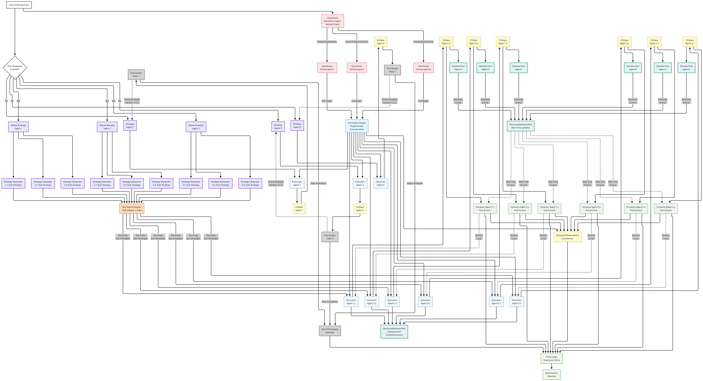

# Iterative Studio

The system integrates with major AI providers (Google AI, OpenAI, Anthropic) and employs multi-agent-based architectures. Deepthink & Contextual Mode provides optional access to python interprator for the models to use. The main agentic refinements agent has access to a searchacademia tool that search for papers on arxiv.

## Operational Modes

The system operates in five distinct modes, each optimized for specific use cases.

### 1. Refine Mode

**Purpose**: Traditional iterative refinements with automated feature suggestion and bug fixing. Does not manage it's own conversation history.

**Architecture**:
- Pipeline-based execution with parallel temperature variations
- Three-stage refinement process per iteration:
  1. Initial content generation
  2. Feature suggestion agent (novelty-seeking or quality-focused)
  3. Bug fix agent (syntax/runtime error correction)

**Key Components**:
- `PipelineState`: Manages multiple concurrent refinement pipelines
- `IterationData`: Tracks individual iteration states and content evolution
- Evolution mode support (Novelty/Quality) for feature generation

**Workflow**:
1. User provides initial prompt
2. System generates base content across multiple temperature settings (This is currently disabled)
3. Feature suggestion agent proposes enhancements
4. Bug fix agent validates and corrects errors
5. Process repeats for configured number of iterations

### 2. Deepthink Mode

**Purpose**: Complex problem-solving through strategic decomposition and hypothesis exploration.

**Architecture**:
- Multi-strategy parallel exploration system
- Three operational strategies:
  1. **Strategic Solver**: Decomposes problems into main strategies and sub-strategies
  2. **Hypothesis Explorer**: Generates and tests multiple hypotheses
  3. **Dissected Observations**: Analyzes problem from multiple perspectives
4. **Red Team Filter**: Filters weak strategies and sub-strategies

**Agent Pipeline**:
- **Strategy Generation Agent**: Creates high-level approaches
- **Sub-Strategy Agent**: Breaks down strategies into actionable steps
- **Solution Agent**: Implements sub-strategy solutions
- **Critique Agent**: Evaluates solution quality
- **Refinement Agent**: Applies self-improvement corrections
- **Iterative Corrections**: Refines solutions iteratively with Critique + Correction Loop.
- **Red Team Agent**: Validates and filters weak solutions
- **Final Judge Agent**: Selects optimal solution

**Key Features**:
- Iterative correction loops for solution refinement
- Red team evaluation for quality control
- Configurable depth (strategies, sub-strategies, hypotheses)
- Parallel execution of multiple solution paths

**Workflow**:
1. Problem decomposed into main strategies
2. Each strategy expanded into sub-strategies
3. Solutions generated for each sub-strategy
4. Solutions critiqued and refined
5. Red team filters weak solutions
6. Final judge selects best approach





### 3. Adaptive Deepthink Mode

**Purpose**: Provide full access of deepthink mode to an agent.

**Architecture**:
- Hybrid system merging Agentic mode UI with Deepthink agent tools
- Conversation manager maintains context across tool invocations
- Real-time UI updates as agents execute

**Tool System**:
- `GenerateStrategies`: Creates main problem-solving strategies
- `GenerateHypotheses`: Produces testable hypotheses
- `TestHypotheses`: Validates hypothesis viability
- `ExecuteStrategies`: Implements strategic solutions
- `SolutionCritique`: Provides critical evaluation
- `CorrectedSolutions`: Applies refinements
- `SelectBestSolution`: Determines optimal solution

**Key Components**:
- `AdaptiveDeepthinkCore.ts`: Manages tool execution and state
- `AdaptiveDeepthinkConversationManager`: Handles context and history
- Integration with Deepthink rendering pipeline for visualization

**Workflow**:
1. User engages in natural conversation
2. AI determines when to invoke deep reasoning tools
3. Tools execute with full Deepthink pipeline visualization
4. Results integrated back into conversation context
5. Process continues iteratively until solution reached

### 4. Agentic Mode

**Purpose**: General-purpose iterative refinement with tool-based content manipulation.

**Architecture**:
- Conversation-based interaction model
- LangChain integration for advanced capabilities
- Diff-based editing system for precise modifications

**Core Components**:
- `AgenticCoreLangchain.ts`: Manages conversation state and tool execution
- `AgenticConversationManager`: Handles context window management
- `AgenticUI.tsx`: Real-time activity visualization

**Tool System**:
- `ApplyDiff`: Apply targeted code modifications
- `ReadFile`: Access external file content
- `SearchWeb`: External information retrieval (optional)
- `ArxivSearch`: Academic paper search (optional)

**Key Features**:
- Streaming response handling
- Segment-based parsing (text, thinking, diff commands, tool calls)
- Automatic context management with message summarization
- System blocks for progress tracking

**Workflow**:
1. User submits request in conversational format
2. AI analyzes and determines necessary tools
3. Tools execute with real-time feedback
4. Content iteratively refined through diff operations
5. Process continues until user satisfaction

### 5. Contextual Mode

**Purpose**: Iterative refinement through specialized agent collaboration.

This can work stable upto 2 Hours without human intervention for difficult problems and actually yield high quality insights and results.

**Architecture**:
- Three-agent system with distinct responsibilities:
  1. **Main Generator**: Produces content based on user requirements
  2. **Iterative Agent**: Suggests improvements and corrections
  3. **Memory Agent**: Works like a long term memory.

**Key Components**:
- `ContextualCore.ts`: State management and history tracking
- Separate history managers for each agent type
- Automated context window management

**Agent Interaction**:
```
User Request → Main Generator → Generated Content
                      ↓
              Iterative Agent → Suggestions
                      ↓
              Main Generator → Refined Content
                      ↓
              [Repeat until complete]
                      ↓
              Memory Agent → History Compression
```

**Key Features**:
- Automatic history condensation when context limits approached
- Iterative refinement through suggestion-response cycles
- Clean separation of concerns between agents
- Real-time visualization of agent interactions

**Workflow**:
1. Main generator creates initial content
2. Iterative agent analyzes and suggests improvements
3. Main generator applies suggestions
4. Memory agent compresses history when needed
5. Cycle continues until completion criteria met

## Configuration

### Model Selection

Supports configuration of:
- AI provider (Google, OpenAI, Anthropic)
- Model selection per provider
- Temperature and Top-P sampling parameters
- Mode-specific parameters (iteration depth, agent counts)

### Mode-Specific Settings

**Website**:
- Refinement stages count
- Evolution mode (Novelty/Quality)

**Deepthink/Adaptive**:
- Strategy count
- Sub-strategy count
- Hypothesis count
- Red team aggressiveness
- Iterative corrections toggle

## Data Flow

### Request Flow
```
User Input → Routing Layer → AI Provider → Response Parser → Mode Handler → UI Update
```

### State Management
```
Global State (index.tsx) → Mode-Specific State → Component State → UI Rendering
```

### Agent Communication (Contextual/Agentic)
```
User → Main Agent → [Tools/Sub-Agents] → Response Integration → History Management
```

## Retry and Error Handling

All modes implement exponential backoff retry logic:
- Maximum 3 retry attempts
- Initial delay: 20 seconds
- Backoff factor: 4x
- Graceful degradation on failure

Error states tracked per pipeline/iteration with detailed error messages and recovery options.

## Import/Export

Supported operations:
- State export (JSON format)
- State import with validation
- Cross-session persistence
- Mode-specific state serialization

## Build System

- **Build Tool**: Vite
- **Language**: TypeScript
- **UI Framework**: React 19
- **Code Editor**: Monaco Editor
- **Styling**: Custom CSS with modern design patterns

## Development

### Project Structure
```
/Agentic          - Agentic mode implementation
/AdaptiveDeepthink - Adaptive Deepthink mode
/Components       - Shared UI components
/Contextual       - Contextual mode implementation
/Deepthink        - Deepthink mode implementation
/Routing          - AI provider routing
/Parsing          - Response parsing utilities
index.tsx         - Main application entry
prompts.ts        - Prompt templates
```

### Key Dependencies
```json
{
  "@anthropic-ai/sdk": "AI provider",
  "@google/genai": "AI provider",
  "openai": "AI provider",
  "@langchain/core": "Agent framework",
  "@monaco-editor/react": "Code editor",
  "diff2html": "Diff visualization",
  "katex": "Math rendering",
  "react-flow": "Graph visualization"
}
```

## License

Apache-2.0
